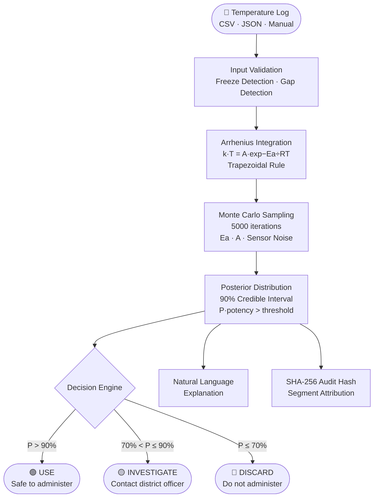
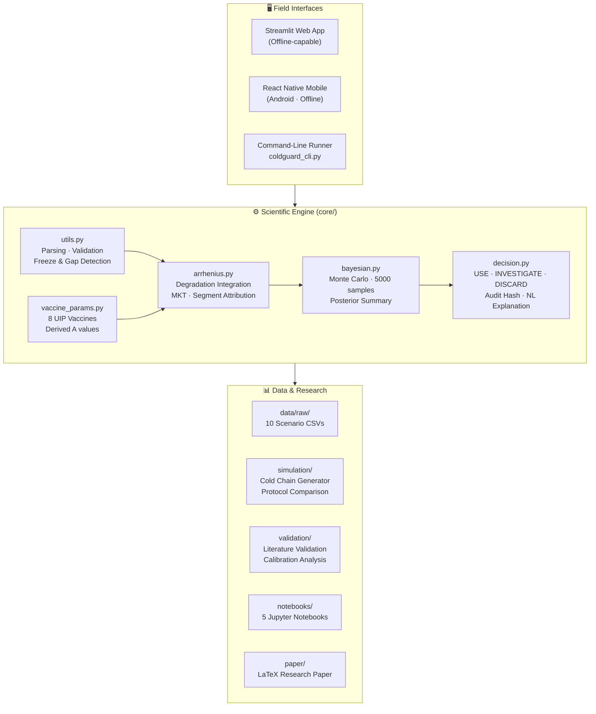
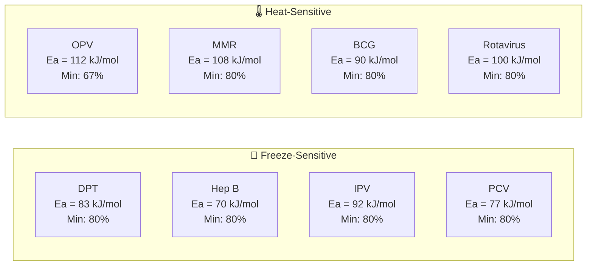
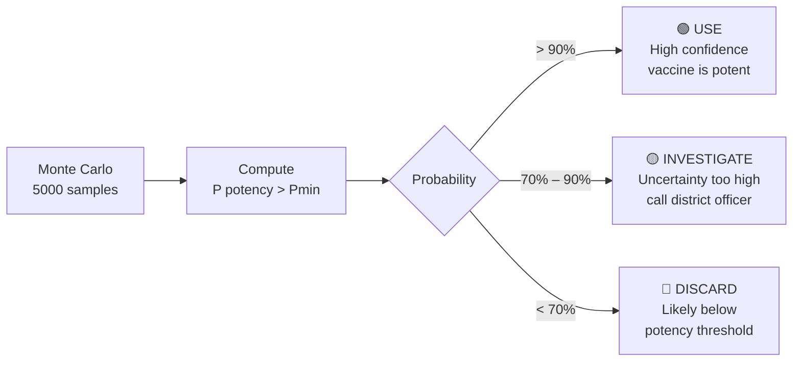
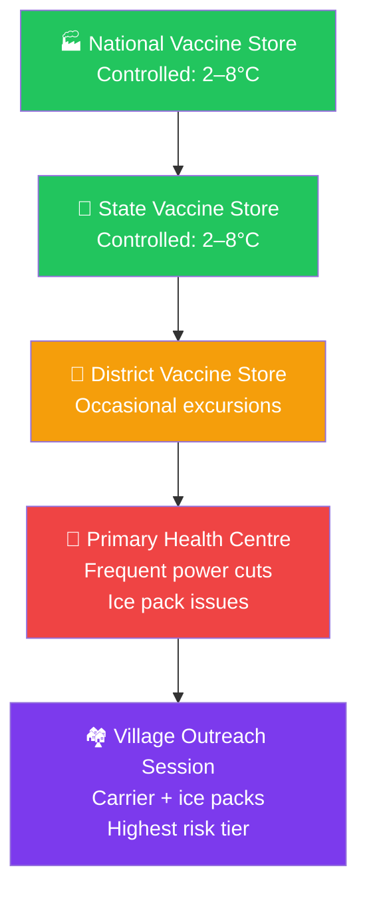
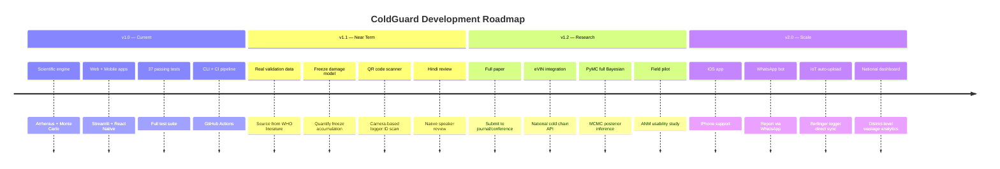

<div align="center">

# 🧊 ColdGuard

### Kinetic-Bayesian Vaccine Potency Estimation for India's Cold Chain

*Don't discard vaccines that are still potent. Don't administer ones that aren't.*

[](LICENSE)
[](https://python.org)
[](tests/)
[]()
[]()
[]()

<br/>

> **ColdGuard** is a science-grade, field-deployable decision support tool for ANMs, cold chain officers, and PHC staff. Given a temperature log, it tells you — with calibrated confidence — whether a vaccine is still safe to use.

</div>

---

## The Problem

India's Universal Immunisation Programme delivers **390 million doses per year** through a cold chain network that stretches from national vaccine stores to village-level outreach sessions. Temperature excursions happen at every tier — power cuts, broken ice packs, transport delays.

Current protocols respond with one of two equally bad choices:

| Protocol | Problem |
|----------|---------|
| **Discard on any alarm** | Destroys potent vaccines. Millions of doses wasted every year. Costs money, erodes trust. |
| **Use it anyway** | Risks administering under-potent doses. Children aren't protected. |
| **VVM (Vaccine Vial Monitor)** | Binary indicator, conservatively calibrated. High false discard rate. No confidence interval. |

**ColdGuard replaces guesswork with physics.**

---

## How It Works



---

## The Science in One Equation

Vaccine degradation follows **first-order Arrhenius kinetics**. For a discrete temperature log:

$$P_{\text{remaining}} = \exp\!\left(-\sum_{i} \frac{k(T_i) + k(T_{i+1})}{2} \cdot \Delta t_i\right) \qquad k(T) = A \cdot e^{-E_a / RT}$$

ColdGuard propagates uncertainty in **Eₐ**, **A**, and **sensor readings** through 5,000 Monte Carlo samples to produce a calibrated posterior, not just a point estimate.

---

## System Architecture



---

## Quick Start

### Web App

```bash
git clone https://github.com/Santhosh-zeta/ColdGuard.git
cd ColdGuard
pip install numpy scipy pandas plotly streamlit

PYTHONPATH=. streamlit run web_app/app.py
```

### Command Line

```bash
# Demo: DPT vaccine after an 11-hour power outage
PYTHONPATH=. python coldguard_cli.py \
    --input data/raw/demo_dpt_power_outage.csv \
    --vaccine DPT

# Output JSON report
PYTHONPATH=. python coldguard_cli.py \
    --input data/raw/extended_excursion_25c.csv \
    --vaccine OPV \
    --output report.json
```

### Python API

```python
from core.utils import parse_csv_log, run_analysis

timestamps, temperatures = parse_csv_log("data/raw/demo_dpt_power_outage.csv")

result = run_analysis(
    vaccine_type="DPT",
    timestamps=timestamps,
    temperatures_C=temperatures,
    n_mc_samples=5000,
)

dec = result["decision_output"]
print(dec.decision.value)              # "USE"
print(dec.estimated_potency_pct)       # 99.8
print(dec.ci_90)                       # (99.2, 100.0)
print(dec.natural_language_explanation)
```

### Run Tests

```bash
PYTHONPATH=. python -m pytest tests/ -v
# 37 passed ✅
```

---

## Supported Vaccines — India UIP



| Code | Vaccine | Eₐ (kJ/mol) | Shelf Life | Ref Temp | Min Potency | Freeze Sensitive |
|------|---------|:-----------:|:----------:|:--------:|:-----------:|:----------------:|
| DPT | Diphtheria-Pertussis-Tetanus | 83 ± 4 | 24 months | 5°C | 80% | ⚠️ Yes |
| OPV | Oral Polio Vaccine | 112 ± 6 | 6 months | 5°C | 67% | ✅ No |
| MMR | Measles-Mumps-Rubella | 108 ± 7 | 12 months | 5°C | 80% | ✅ No |
| BCG | Bacillus Calmette-Guérin | 90 ± 5 | 12 months | 5°C | 80% | ✅ No |
| HepB | Hepatitis B | 70 ± 4.5 | 24 months | 5°C | 80% | ⚠️ Yes |
| IPV | Inactivated Polio Vaccine | 92 ± 5.5 | 24 months | 5°C | 80% | ⚠️ Yes |
| Rotavirus | Rotavirus Vaccine | 100 ± 6 | 24 months | −15°C | 80% | ✅ No |
| PCV | Pneumococcal Conjugate Vaccine | 77 ± 4 | 24 months | 5°C | 80% | ⚠️ Yes |

---

## Decision Logic



---

## Cold Chain Tiers — India Simulation



ColdGuard was designed and tested against all three field-tier profiles (District, PHC, Outreach) with realistic excursion distributions modeled on published cold chain monitoring studies.

---

## Repository Structure

```
ColdGuard/
│
├── 🧬 core/                        Scientific engine
│   ├── arrhenius.py                Arrhenius integrator · MKT · segment attribution
│   ├── bayesian.py                 Monte Carlo uncertainty propagation
│   ├── decision.py                 USE/INVESTIGATE/DISCARD · audit hash
│   ├── vaccine_params.py           8 UIP vaccines with derived A values
│   └── utils.py                    Parsing · validation · run_analysis pipeline
│
├── 🌐 web_app/                     Streamlit web application
│   ├── app.py                      3-state UI (input → processing → results)
│   └── components/                 input_form · results_display · charts
│
├── 📱 mobile_app/                  React Native + Expo (Android)
│   └── src/
│       ├── engine/arrhenius.js     Full offline JS engine (1000-sample MC)
│       ├── screens/                Input · Processing · Results screens
│       ├── components/             DecisionBanner · PotencyChart · Timeline
│       └── i18n/                   English + Hindi + Telugu translations
│
├── 🔬 simulation/                  Protocol comparison study
│   ├── cold_chain_generator.py     District · PHC · Outreach profiles
│   └── protocol_comparison.py      ColdGuard vs MKT vs VVM · FDR/FUR metrics
│
├── ✅ validation/                  Scientific validation
│   ├── literature_validation.py    Published stability data validation
│   └── calibration_analysis.py    Coverage · RMSE · Bland-Altman
│
├── 📓 notebooks/                   Jupyter analysis
│   ├── 01_arrhenius_exploration    Rate curves for all 8 vaccines
│   ├── 02_parameter_derivation     A values from shelf-life derivation
│   ├── 03_validation_analysis      Literature comparison
│   ├── 04_simulation_study         1000-scenario protocol comparison
│   └── 05_paper_figures            All 6 publication-ready figures
│
├── 📊 data/
│   ├── raw/                        10 synthetic cold chain CSVs + demo scenario
│   ├── validation/                 Stability datasets (DPT, OPV, MMR)
│   └── parameters/                 vaccine_arrhenius_db.json
│
├── 📄 paper/                       Research paper
│   ├── main.tex                    7-section LaTeX skeleton
│   └── references.bib              WHO · ICH · literature bibliography
│
├── 📚 docs/
│   ├── SCIENCE.md                  Full Arrhenius + Bayesian derivation
│   ├── API.md                      Complete public API reference
│   └── USER_GUIDE.md              Step-by-step guide for field staff
│
├── 🧪 tests/                       37 tests · all passing
│   ├── test_arrhenius.py           8 tests
│   ├── test_bayesian.py            7 tests
│   ├── test_decision.py            8 tests
│   └── test_scenarios.py           14 scenario-level integration tests
│
├── coldguard_cli.py                Command-line runner
└── .github/workflows/test.yml      CI: runs all tests on every push
```

---

## Example Output

```
ColdGuard Analysis — DPT (Diphtheria-Pertussis-Tetanus)
════════════════════════════════════════════════════════════

✅  USE  — Vaccine retains sufficient potency. Safe to administer.

  Potency estimate : 99.8%
  90% CI           : 99.2% – 100.0%
  Confidence       : 100%

  ColdGuard estimates DPT potency at 99.8% (90% CI: 99.2–100.0%).
  Minimum acceptable potency is 80%. Primary degradation source:
  11 hours at 14.3°C, accounting for 87% of total heat stress.
  It is safe to USE this vaccine.

  MKT: 11.26°C   Point estimate: 99.95%
  Audit hash: e21be4c1e394f7f0…

  Top degradation segments:
    1.0 h at mean 14.3°C  →  8.7% of total loss
    1.0 h at mean 14.3°C  →  8.7% of total loss
    1.0 h at mean 14.3°C  →  8.7% of total loss
```

---

## Roadmap — What We Can Build Next



### Priority Improvements

#### 🔬 Scientific Quality
| # | Improvement | Impact | Effort |
|---|------------|--------|--------|
| 1 | **Source real validation data** from WHO/GPV/98.07 for all 8 vaccines — replace synthetic circular validation with actual published temperature-potency pairs | 🔴 Critical for publication | High |
| 2 | **Freeze damage accumulator** — DPT/HepB/IPV/PCV are damaged by freezing; model protein denaturation kinetics from published shake-test data | 🔴 Clinically significant | High |
| 3 | **Derive Eₐ independently** — use two published stability data points per vaccine: `ln(k₁/k₂) = -Eₐ/R · (1/T₁ − 1/T₂)` | 🟡 Strengthens paper | Medium |
| 4 | **PyMC full Bayesian** — replace Monte Carlo with proper MCMC posterior (PyMC already in requirements); enables formal model comparison | 🟡 Research upgrade | Medium |
| 5 | **Sensitivity analysis** — show FDR reduction holds under ±10% Eₐ variation; answers the primary reviewer question | 🟡 Paper reviewer ready | Low |

#### 📱 Feature Completeness
| # | Improvement | Impact | Effort |
|---|------------|--------|--------|
| 6 | **QR code scanner** in mobile app — scan Berlinger Fridge-tag logger ID via camera (spec Week 18 requirement) | 🟡 Field usability | Medium |
| 7 | **Hindi translation review** — `hi.js` needs review by a Hindi-speaking ANM or health worker for medical accuracy | 🟡 Accessibility | Low |
| 8 | **iOS support** — currently Expo/React Native targets Android; minor config change adds iOS | 🟢 Reach | Low |
| 9 | **WhatsApp integration** — field staff already use WhatsApp; a bot that accepts a forwarded CSV and returns a verdict removes app-install barrier | 🔴 Adoption | High |
| 10 | **Berlinger / LogTag auto-sync** — direct USB/BLE import from common Indian cold chain loggers instead of manual CSV export | 🟡 Usability | High |

#### 🏗️ Engineering
| # | Improvement | Impact | Effort |
|---|------------|--------|--------|
| 11 | **eVIN API integration** — India's Electronic Vaccine Intelligence Network has an open API; push analysis results into the national cold chain record | 🔴 National scale | High |
| 12 | **District dashboard** — Streamlit multi-page app showing batch-level wastage analytics for district cold chain officers | 🟡 Decision makers | Medium |
| 13 | **Offline PWA** — Progressive Web App wrapping so health workers without smartphones can use the web app offline from a feature phone browser | 🟡 Last-mile reach | Medium |
| 14 | **Audit trail export** — digital signature on PDF reports, exportable to HMIS/DHIS2 | 🟢 Compliance | Low |

#### 📄 Research Paper
| # | Task | Status |
|---|------|--------|
| 15 | Fill in `paper/main.tex` Results section with simulation study numbers | 🔲 Pending |
| 16 | Generate paper figures (run `notebooks/05_paper_figures.ipynb`) | 🔲 Pending |
| 17 | Submit to **Vaccine** journal or **npj Digital Medicine** | 🔲 Pending |
| 18 | Record 3-minute demo video for GitHub and supplementary | 🔲 Pending |

---

## Scientific References

| Source | Used For |
|--------|----------|
| WHO/GPV/98.07 — Galazka AM et al., *Thermostability of Vaccines*, 1998 | Eₐ values, stability data |
| WHO/IVB/06.10 — *Temperature Sensitivity of Vaccines*, 2006 | MKT methodology, VVM specifications |
| ICH Q1E — *Evaluation of Stability Data*, 2003 | Arrhenius stability framework |
| Matthias DM et al., *Vaccine* 25:20, 2007 | Freeze event prevalence |

---

## License

MIT — see [LICENSE](LICENSE). Free to use, modify, and deploy in public health programmes.

---

<div align="center">

**Built for India's 390 million doses per year.**

*ANMs shouldn't have to guess. Now they don't.*

</div>
